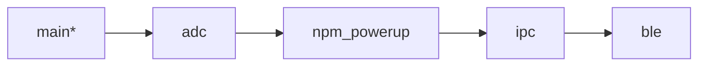

# nrf_peripheral_dmm

   
  
   
  An application/workshop on leveraging an nRF54L15DK to be a Bluetooth Low Energy (BLE) peripheral to read the analog outputs of an nPM2100EK's regulators and viewing them on your mobile device.

# Prerequisites and Required Material
## Hardware
- nRF54L15 DK
 
  
- nPM2100 EK

   
- Nordic multi-USB cable x 2

  
- AA Battery (other types work as well) 

- 3x Female-Female jumper wires
> ⬆️ All above provided by Nordic, and you will keep upon completion of the workshop ⬆️

- Bring your own laptop 💻 **setup with software ahead of time**

## Software
> [!IMPORTANT]  
> You must complete the first lesson of the [Nordic DevAcademy](https://academy.nordicsemi.com/courses/nrf-connect-sdk-fundamentals/) for this workshop.
> 
> You must be able to build and be able to flash a blank application. If you do not have a DK, at the very least a successful build system is required.
> **These are large downloads and take a long time. Please complete before the workshop.**
 
### Installing and setting up nRF Connect SDK (NCS) 🔗[LINK](https://academy.nordicsemi.com/courses/nrf-connect-sdk-fundamentals/lessons/lesson-1-nrf-connect-sdk-introduction/topic/exercise-1-1/)

### Extra tools
- nRF Connect for Desktop ([Link](https://www.nordicsemi.com/Products/Development-tools/nRF-Connect-for-Desktop/Download#infotabs))

      - Install Serial Terminal app
  
      - Install nPM PowerUP
  
      - Install Board Configurator
- nRF Connect for Mobile ([Link](https://www.nordicsemi.com/Products/Development-tools/nRF-Connect-for-mobile)) for iOS/Android

# Workshop Outline
  - Intro Slides / chalk talk
    - Intro to [nPM2100](https://www.nordicsemi.com/Products/nPM2100)

     

    - Intro to [nRF54L15](https://www.nordicsemi.com/Products/nRF54L15)

       

    - Intro to nRF Connect for Desktop
    - Intro to VS Code and Nordic VSC Extensions
    - Hands on
   
# Hands on
## Goal and Progression Path
There are a few branches in this repo, here is the intended progression path for you as you walk through this workshop.

> `*` == your current location

## High-level architecture
At a high level, we will write an application for the nRF54L15 SoC  (using two ADC channels on the nRF54L15, one per regulator) to read the analog output of each regulator on the nPM2100, then pipe that data via a BLE connection to our mobile devices. 

So, a little BLE peripheral Multimeter. Using nPM PowerUP, we can change the regulator outputs of the nPM2100 PMIC, and see the regulator voltage measurements change on our mobile device.

This workshop assumes you've at least completed the first lesson of the nRF Connect SDK Fundamentals in the Nordic DevAcademy.
If you haven't, here is a link, but expect to be left behind! [🔗LINK](https://academy.nordicsemi.com/courses/nrf-connect-sdk-fundamentals/)

## Add the application to VSCode:
- Clone this repo
- Click on the nRF Connect icon in the left hand ribbon
- Click on Open an existing application
- Select the directory of this repository
- Click Open:

## Under Applications at the bottom of the left pane 
- Click on Add build configuration 
- Select `nrf54l15dk/nrf54l15/cpuapp` as the board target
- Choose the _Browse_ option for Base Devicetree Overlays and select the `nrf54l15dk_nrf54l15_cpuapp.overlay` file in the `boards/` child directory of the repository.
- Click Build Configuration on the bottom right
 
  
 

## Set up the 54L15DK
- Plug your 54L15DK into your machine.
- Open nRF Connect for Desktop, and open the board configurator, and configure the 54L15DK to be 3V3 by changing the VDD option and selecting "Write config"

  
## Move to the adc branch for the next set of instructions: [➡️LINK](https://github.com/droidecahedron/nrf_peripheral_dmm/tree/adc)
