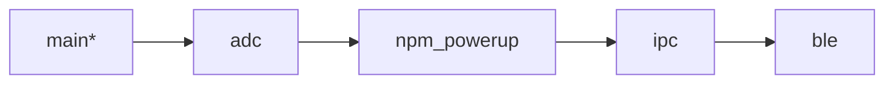

  

# Required Materials
## Hardware
- nRF54L15 DK
  
  
- nPM2100 EK

   
- Nordic multi-USB cable x 2

  
- AA Battery (other types work as well) 

- Laptop 💻 setup with software ahead of time
## Software
### Installing and setting up nRF Connect SDK NCS) 🔗[LINK](https://academy.nordicsemi.com/courses/nrf-connect-sdk-fundamentals/lessons/lesson-1-nrf-connect-sdk-introduction/topic/exercise-1-1/)
**These are large downloads and take a long time. Please complete before the workshop.**
### Extra tools
- nRF Connect for Desktop ([Link](https://www.nordicsemi.com/Products/Development-tools/nRF-Connect-for-Desktop/Download#infotabs))
      - Install Serial Terminal app
      - Install nPM PowerUP
      - Install Board Configurator
- nRF Connect for Mobile ([Link](https://www.nordicsemi.com/Products/Development-tools/nRF-Connect-for-mobile)) for iOS/Android

# Workshop Outline
  - Intro Slides / chalk talk
    - Intro to nPM2100 ([Link](https://www.nordicsemi.com/Products/nPM2100))

     

    - Intro to nRF54L15 ([Link](https://www.nordicsemi.com/Products/nRF54L15))

       

    - Intro to nRF Connect for Desktop
    - Intro to VS Code and Nordic VSC Extensions
    - Hands on
   
# Hands on
## Goal and Progresion Path
There are a few branches in this repo, here is the intended progression path for you as you walk through this workshop.

> `*` == your current location

At a high level, we will write an application for the nRF54L15 SoC to read the analog output of each regulator on the nPM2100, then pipe that data via a BLE connection to our mobile devices. (So a little BLE Multimeter)

This workshop assumes you've at least completed the first two lessons of the nRF Connect SDK Fundamentals in the Nordic DevAcademy.
If you haven't, here is a link, but expect to be left behind! [🔗LINK](https://academy.nordicsemi.com/courses/nrf-connect-sdk-fundamentals/)

## Add the application to VSCode:
- Clone this repo
- Click on the nRF Connect icon in the left hand ribbon
- Click on Open an existing application
- Select the directory of this repository
- Click Open: 

## Under Applications at the bottom of the left pane 
- Click on Add build configuration 
- Select `nrf54l15dk/nrf54l15/cpuapp` as the board target
- Click Build Configuration on the bottom right 

## Set up the 54L15DK
- Plug in your 54L15DK
- Open nRF Connect for Desktop, and open the board configurator, and configure the 54L15DK to be 3V3 by changing the VDD option and selecting "Write config"

  
## Move to the adc branch for the next set of instructions: [➡️LINK](https://github.com/droidecahedron/Teardown-2025/tree/adc)
